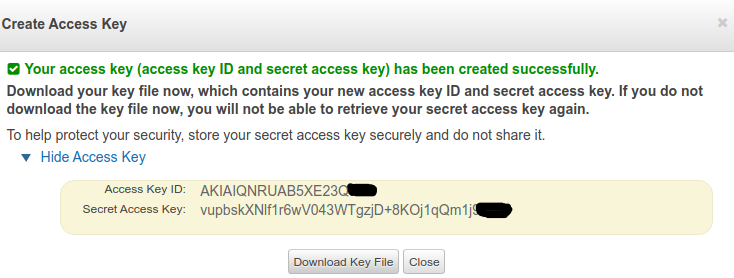
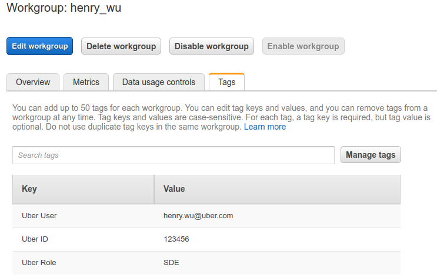
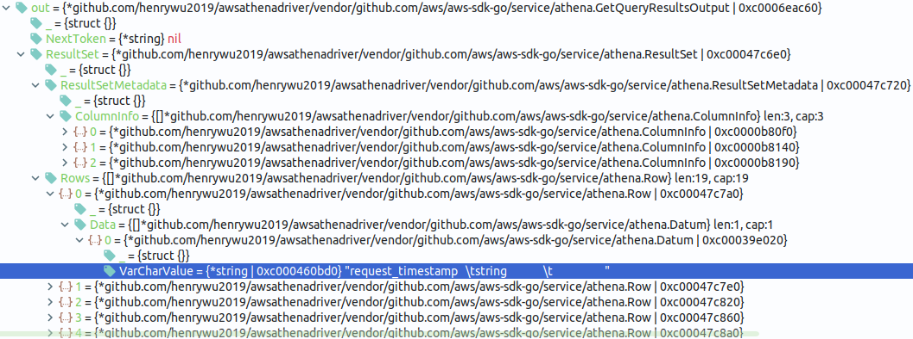
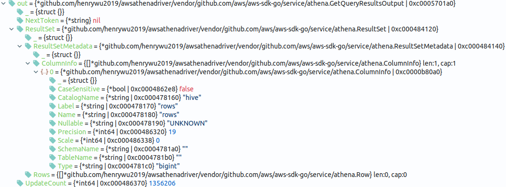
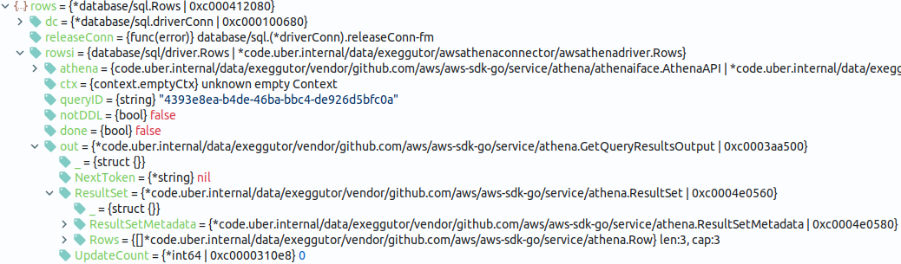

[![CodeCov][cov-img]][cov]
[![GoDoc][doc-img]][doc]
[![Github release][release-img]][release]
[![Build Status][ci-img]][ci]
[![FOSSA][fossa-img]][fossa]
[![Go Report Card][report-card-img]][report-card]
[![lic][license-img]][license]
[![made][made-img]][made]

----

:package: [athenadriver](https://github.com/uber/athenadriver/tree/master/go) - A fully-featured AWS Athena database driver for Go  
:shell: [athenareader](https://github.com/uber/athenadriver/tree/master/athenareader) - A moneywise command line utililty to query athena in command line.

----

## Overview

(This project is a sandbox project and the development status is STABLE.)

`athenadriver` is a fully-featured AWS Athena database driver for Go developed at Uber ATG.
It provides a hassle-free way of querying AWS Athena database with Go standard
library. It not only provides basic features of Athena Go SDK, but 
addresses some SDK's limitation, improves and extends it. Moreover, it also includes
advanced features like Athena workgroup and tagging creation, driver read-only mode and so on.

The PDF version of AthenaDriver document is available at [ :scroll: ](resources/athenadriver.pdf)

## Features

Except the basic features provided by Go `database/sql` like error handling, database pool and reconnection, `athenadriver` supports the following features out of box:

- Support multiple AWS authorization methods [:link:](#support-multiple-aws-authentication-methods)
- Full support of [Athena Basic Data Types](https://docs.aws.amazon.com/athena/latest/ug/data-types.html)
- Full support of [Athena Advanced Type](https://docs.aws.amazon.com/athena/latest/ug/querying-athena-tables.html) for queries with Geospatial identifiers, ML and UDFs 
- Full support of *ALL* Athena Query Statements, including [DDL](https://docs.aws.amazon.com/athena/latest/ug/language-reference.html), [DML](https://docs.aws.amazon.com/athena/latest/ug/functions-operators-reference-section.html) and [UTILITY](https://github.com/aws/aws-sdk-go/blob/master/service/athena/api.go#L5002) [:link:](#full-support-of-all-data-types)
- Support newly added [`INSERT INTO...VALUES`](https://aws.amazon.com/about-aws/whats-new/2019/09/amazon-athena-adds-support-inserting-data-into-table-results-of-select-query/)
- Athena workgroup and tagging support including remote workgroup creation [:link:](#query-with-workgroup-and-tag)
- Go sql's prepared statement support [:link:](#prepared-statement-support-for-athena-db)
- Go sql's `DB.Exec()` and `db.ExecContext()` support [:link:](#dbexec-and-dbexeccontext)
- Query cancelling support [:link:](#query-cancellation)
- Mask columns with specific values [:link:](#mask-columns-with-specific-values)
- Database missing value handling [:link:](#missing-value-handling)
- Read-Only mode - disable database write in driver level [:link:](#read-only-mode)
- Moneywise mode :moneybag: - print out query cost(USD) for each query
- Query with Athena Query ID(QID) - (the ultimate money saver! :money_with_wings: )
- Pseudo commands from database/sql interface: `get_driver_version`, `get_query_id`, `get_query_id_status`, `stop_query_id`, `get_workgroup`, `list_workgroups`, `update_workgroup`, `get_cost`, `get_execution_report` etc [:link:](#pseudo-commands)
- Builtin logging support with zap [:link:](#enable-driver-logging)
- Builtin metrics support with tally [:link:](#enable-metrics)

`athenadriver` can extremely simplify your code. Check [athenareader](https://github.com/uber/athenadriver/tree/master/athenareader) out as an example and a convenient tool for your Athena query in command line. 

## How to set up/install/test `athenadriver`

### Prerequisites - AWS Credentials & S3 Query Result Bucket 

To be able to query AWS Athena, you need to have an AWS account at [Amazon AWS's website](https://aws.amazon.com/). To
 give it a shot, a free
 tier account is enough. You also need to have a pair of AWS `access key ID` and `secret access key`.
You can get it from [AWS Security Credentials section of Identity and Access Management (IAM)](https://docs.aws.amazon.com/general/latest/gr/aws-security-credentials.html).
If you don't have one, please create it. The following is a screenshot from my temporary free tier account:



In addition to AWS credentials, you also need an s3 bucket to store query result. Just go to 
[AWS S3 web console page](https://s3.console.aws.amazon.com/s3/home) to create one.
In the examples below, the s3 bucket I use is `s3://myqueryresults/`.

In most cases, you need the following 4 prerequisites:

- S3 Output bucket
- `access key ID`
- `secret access key`
- AWS region

For more details on `athenadriver`'s support on AWS credentials & S3 query result bucket, please refer to section
 [Support Multiple AWS Authorization Methods](#support-multiple-aws-authentication-methods).

### Installation

```go
go get -u github.com/uber/athenadriver
```

### Tests

We provide unit tests and integration tests in the codebase.

#### Unit Test

All the unit tests are self-contained and passed even in no-internet environment. Test coverage is 100%. 

```bash
$ cd $GOPATH/src/github.com/uber/athenadriver/go
✔ /opt/share/go/path/src/github.com/uber/athenadriver [uber|✚ 1…12] 
21:35 $ go test -coverprofile=coverage.out github.com/uber/athenadriver/go  && \
 go tool cover -func=coverage.out |grep -v 100.0%
ok  	github.com/uber/athenadriver/go	9.255s	coverage: 100.0% of statements
```


#### Integration Test

All integration tests are under [`examples`](https://github.com/uber/athenadriver/tree/master/examples) folder.
Please make sure all prerequisites are met so that you can run the code on your own machine.

All the code snippets in `examples` folder are fully tested in our machines. For example, 
to run some stress and crash test, you can use `examples/perf/concurrency.go`. Build it first:

```go
$cd $GOPATH/src/github.com/uber/athenadriver
$go build examples/perf/concurrency.go
```

Run it, wait for some output but not all, and unplug your network cable:

```go
$./concurrency > examples/perf/concurrency.output.`date +"%Y-%m-%d-%H-%M-%S"`.log
58,13,53,54,78,96,32,48,40,11,35,31,65,61,1,73,74,22,34,49,80,5,69,37,0,79,
2020/02/09 13:49:29 error [38]RequestError: send request failed
caused by: Post https://athena.us-east-1.amazonaws.com/: dial tcp: 
lookup athena.us-east-1.amazonaws.com: no such host
...
2020/02/09 13:49:29 error [89]RequestError: send request failed
caused by: Post https://athena.us-east-1.amazonaws.com/: dial tcp: 
lookup athena.us-east-1.amazonaws.com: no such host
```
You can see `RequestError` is thrown out from the code. The active Athena queries failed because the network is down.
Now re-plugin your cable and wait for network coming back, you can see the program automatically reconnects to Athena, and resumes to output data correctly:

```go
72,25,92,98,15,93,41,7,8,90,81,56,66,2,18,84,87,63,
44,45,82,99,86,3,52,76,71,16,39,67,23,12,42,17,4,
```

## How to use `athenadriver`

`athenadriver` is very easy to use. What you need to do it to import it in your code and then use the standard Go `database/sql` as usual.

```go
import athenadriver "github.com/uber/athenadriver/go"
```

The following are coding examples to demonstrate `athenadriver`'s features and how you should use `athenadriver` in your Go application.
Please be noted the code is for demonstration purpose only, so please follow your own coding style or best practice if necessary.

### Get Started - A Simple Query

The following is the simplest example for demonstration purpose. The source code is available at [dml_select_simple.go](https://github.com/uber/athenadriver/blob/master/examples/query/dml_select_simple.go)\.

```go
package main

import (
	"database/sql"
	drv "github.com/uber/athenadriver/go"
)

func main() {
	// Step 1. Set AWS Credential in Driver Config.
	conf, _ := drv.NewDefaultConfig("s3://myqueryresults/",
		"us-east-2", "DummyAccessID", "DummySecretAccessKey")
	// Step 2. Open Connection.
	db, _ := sql.Open(drv.DriverName, conf.Stringify())
	// Step 3. Query and print results
	var url string
	_ = db.QueryRow("SELECT url from sampledb.elb_logs limit 1").Scan(&url)
	println(url)
}
```

To make it work for you, please replace `OutputBucket`, `Region`, `AccessID` and
 `SecretAccessKey` with your own values. `sampledb` is provided by Amazon so you don't have to worry about it.

To Build it:
```go
$ go build examples/query/dml_select_simple.go 
```

Run it and you can see output like:
```go
$ ./dml_select_simple 
https://www.example.com/articles/553
```

### Support Multiple AWS Authentication Methods

`athenadriver` uses access keys(Access Key ID and Secret Access Key) to sign programmatic requests to AWS.
When if the AWS_SDK_LOAD_CONFIG environment variable was set, `athenadriver` uses [`Shared Config`](https://docs.aws.amazon.com/sdk-for-go/api/aws/session/#pkg-overview), respects [AWS CLI Configuration and Credential File Settings](https://docs.aws.amazon.com/cli/latest/userguide/cli-configure-files.html) and gives it even higher priority over the values set in `athenadriver.Config`.

#### Use AWS CLI Config For Authentication

When environment variable `AWS_SDK_LOAD_CONFIG` is set, it will read `aws_access_key_id`(AccessID) and `aws_secret_access_key`(SecretAccessKey)
from `~/.aws/credentials`, `region` from `~/.aws/config`. For details about `~/.aws/credentials` and `~/.aws/config`, please check [here](https://docs.aws.amazon.com/cli/latest/userguide/cli-configure-files.html).

But you still need to specify correct `OutputBucket` in `athenadriver.Config` because it is not in the AWS client config.

`OutputBucket` is critical in Athena. Even if you have a default value set in Athena web console, you must pass one programmatically or you will get error:
`No output location provided. An output location is required either through the Workgroup result configuration setting or as an API input.`


The sample code below enforces AWS_SDK_LOAD_CONFIG is set, so `athenadriver`'s AWS Session will be created from the configuration values from the shared config (`~/.aws/config`) and shared credentials (`~/.aws/credentials`) files.
Even if we pass all dummy values as parameters in `NewDefaultConfig()` except `OutputBucket`, they are overridden by
the values in AWS CLI config files, so it doesn't really matter.

```go
// To use AWS CLI's Config for authentication
func useAWSCLIConfigForAuth() {
	os.Setenv("AWS_SDK_LOAD_CONFIG", "1")
	// 1. Set AWS Credential in Driver Config.
	conf, err := drv.NewDefaultConfig(secret.OutputBucketProd, drv.DummyRegion,
		drv.DummyAccessID, drv.DummySecretAccessKey)
	if err != nil {
		return
	}
	// 2. Open Connection.
	db, _ := sql.Open(drv.DriverName, conf.Stringify())
	// 3. Query and print results
	var i int
	_ = db.QueryRow("SELECT 456").Scan(&i)
	println("with AWS CLI Config:", i)
	os.Unsetenv("AWS_SDK_LOAD_CONFIG")
}
```

If your AWS CLI setting is valid like mine, this function should output:

```go
with AWS CLI Config: 456
```

The above authentication method also works for querying Athena in [AWS Lambda](https://aws.amazon.com/lambda/). In lambda, you don't have to provide access ID, key and region, and you don't need AWS CLI config files either. You just need to specify the correct output bucket.
Please check the AWS Lambda Go same code [here](https://github.com/uber/athenadriver/tree/master/examples/lambda/Go).

#### Use `athenadriver` Config For Authentication

When environment variable `AWS_SDK_LOAD_CONFIG` is NOT set, you need to pass valid(NOT dummy) `region`, `accessID`, `secretAccessKey` into `athenadriver.NewDefaultConfig()`, in addition to `outputBucket`.

The sample code below ensure `AWS_SDK_LOAD_CONFIG` is not set, then pass four valid parameters into `NewDefaultConfig()`:

```go
// To use athenadriver's Config for authentication
func useAthenaDriverConfigForAuth() {
	os.Unsetenv("AWS_SDK_LOAD_CONFIG")
	// 1. Set AWS Credential in Driver Config.
	conf, err := drv.NewDefaultConfig(secret.OutputBucketDev, secret.Region,
		secret.AccessID, secret.SecretAccessKey)
	if err != nil {
		return
	}
	// 2. Open Connection.
	db, _ := sql.Open(drv.DriverName, conf.Stringify())
	// 3. Query and print results
	var i int
	_ = db.QueryRow("SELECT 123").Scan(&i)
	println("with AthenaDriver Config:", i)
}
```
The sample output:

```go
with AthenaDriver Config: 123
```

The full code is here at [examples/auth.go](https://github.com/uber/athenadriver/tree/master/examples/auth.go).

### Full Support of All Data Types 

As we said, `athenadriver` supports all Athena data types. 
In the following sample code, we use an SQL statement to `SELECT` som simple data of all the advanced types and then print them out.

```go
package main

import (
	"context"
	"database/sql"
	drv "github.com/uber/athenadriver/go"
)

func main() {
	// 1. Set AWS Credential in Driver Config.
	conf, err := drv.NewDefaultConfig("s3://myqueryresults/",
		"us-east-2", "DummyAccessID", "DummySecretAccessKey")
	if err != nil {
		panic(err)
	}
	// 2. Open Connection.
	dsn := conf.Stringify()
	db, _ := sql.Open(drv.DriverName, dsn)
	// 3. Query and print results
	query := "SELECT JSON '\"Hello Athena\"', " +
		"ST_POINT(-74.006801, 40.70522), " +
		"ROW(1, 2.0),  INTERVAL '2' DAY, " +
		"INTERVAL '3' MONTH, " +
		"TIME '01:02:03.456', " +
		"TIME '01:02:03.456 America/Los_Angeles', " +
		"TIMESTAMP '2001-08-22 03:04:05.321 America/Los_Angeles';"
	rows, err := db.Query(query)
	if err != nil {
		panic(err)
	}
	defer rows.Close()
	println(drv.ColsRowsToCSV(rows))
}
```

Sample output:
```bash
"Hello Athena",00 00 00 00 01 01 00 00 00 20 25 76 6d 6f 80 52 c0 18 3e 22 a6 44 5a 44 40,
{field0=1, field1=2.0},2 00:00:00.000,0-3,0000-01-01T01:02:03.456-07:52,
0000-01-01T01:02:03.456-07:52,2001-08-22T03:04:05.321-07:00
```

we can see `athenadriver` can handle all these advanced types correctly.


### Query With Workgroup and Tag 

`athenadriver` supports workgroup and tagging features of Athena. When you query Athena, you can specify the
 workgroup and tags attached with your query. Resource/cost tagging are based on workgroup. If the workgroup doesn't
 exist , by default it will be created programmatically.
 
If you want to disable programmatically creating workgroup and tags, you need to explicitly call:
```go
Config.SetWGRemoteCreationAllowed(false)
```
In this case, you need to make sure the workgroup you specifies must exist, or you will get error. An example is like
 below:

```go
package main

import (
	"database/sql"
	"log"
	drv "github.com/uber/athenadriver/go"
)

func main() {
	// 1. Set AWS Credential in Driver Config.
	conf, _ := drv.NewDefaultConfig("s3://myqueryresults/",
		"us-east-2", "DummyAccessID", "DummySecretAccessKey")
	wgTags := drv.NewWGTags()
	wgTags.AddTag("Uber User", "henry.wu@uber.com")
	wgTags.AddTag("Uber ID", "123456")
	wgTags.AddTag("Uber Role", "SDE")
	// Specify that workgroup `henry_wu` is used for the following query
	wg := drv.NewWG("henry_wu", nil, wgTags)
	conf.SetWorkGroup(wg)
	// comment out the line below to allow remote workgroup creation and
	// the query will be successful!!!
	conf.SetWGRemoteCreationAllowed(false)
	// 2. Open Connection.
	dsn := conf.Stringify()
	db, _ := sql.Open(drv.DriverName, dsn)
	// 3. Query and print results
	rows, err := db.Query("select url from sampledb.elb_logs limit 3")
	if err != nil {
		log.Fatal(err)
		return
	}
	defer rows.Close()

	var url string
	for rows.Next() {
		if err := rows.Scan(&url); err != nil {
			log.Fatal(err)
		}
		println(url)
	}
}
```

But I don't have a workgroup named `henry_wu` in AWS Athena, so I got sample output:
```go
2020/01/20 15:29:52 Workgroup henry_wu doesn't exist and workgroup remote creation
 is disabled.
```


After commenting out `conf.SetWGRemoteCreationAllowed(false)` at line 27, the output becomes:

```go
https://www.example.com/articles/553
http://www.example.com/images/501
https://www.example.com/images/183
```

and I can see a new workgroup named `henry_wu` is created in AWS Athena console: [https://us-east-2.console.aws
.amazon.com/athena/workgroups/home](https://us-east-2.console.aws.amazon.com/athena/workgroups/home)



###  Prepared Statement Support for Athena DB 

Athena doesn't support prepared statement originally. However, it could be very helpful in some 
scenarios like where part of the query is from user input. `athenadriver` supports prepared statements 
to help you to deal with those scenarios. An example is as follows:

```go
package main

import (
	"database/sql"
	drv "github.com/uber/athenadriver/go"
)

func main() {
	// 1. Set AWS Credential in Driver Config.
	conf, _ := drv.NewDefaultConfig("s3://myqueryresults/",
		"us-east-2", "DummyAccessID", "DummySecretAccessKey")
	// 2. Open Connection.
	db, _ := sql.Open(drv.DriverName, conf.Stringify())
	// 3. Prepared Statement
	statement, err := db.Prepare("CREATE TABLE sampledb.urls AS " +
		"SELECT url FROM sampledb.elb_logs where request_ip=? limit ?")
	if err != nil {
		panic(err)
	}
	// 4. Execute prepared Statement
	if result, e := statement.Exec("244.157.42.179", 2); e == nil {
		if rowsAffected, err := result.RowsAffected(); err == nil {
			println(rowsAffected)
		}
	}
}
```

Sample output:
```go
2
```

You can also use the `?` syntax with `DB.Query()` or `DB.Exec()` directly.

```go
	rows, err := db.Query("SELECT request_timestamp,elb_name "+
		"from sampledb.elb_logs where url=? limit 1",
		"https://www.example.com/jobs/878")
	if err != nil {
		return
	}
	println(drv.ColsRowsToCSV(rows))
```

Sample Output:
```bash
request_timestamp,elb_name
2015-01-06T04:03:01.351843Z,elb_demo_006
```


###  `DB.Exec()` and `DB.ExecContext()` 

According to Go source code, `DB.Exec()` and `DB.ExecContext()` execute a query that doesn't return rows, 
such as an `INSERT` or `UPDATE`.
It's true that you can use `DB.Exec()` and `DB.Query()` interchangeably to execute the same SQL statements.
\
However, the two methods are for different use cases and return different types of results. According to Go `database/sql` library, the result 
returned from `DB.Exec()` can tell you how many rows were affected by the query and the last inserted ID for `INSERT INTO` statement, 
which is always *-1* for Athena because auto-increment primary key feature is not supported by Athena.\
In contrast, `DB.Query()` will return a `sql.Rows` object which includes all columns and rows details.

When the only concern is if the execution is successful or not, `DB.Exec()` is 
preferred to `DB.Query()` . The best coding practice is:

```go
if _, err := DB.Exec(`<SQL_STATEMENT>`); err != nil {
    log_or_panic(err)
}
```

In cases of `INSERT INTO`, `CTAG` and `CVAS`, you may want to know when the execution 
is successful how many rows are affected by your query. Then you can use `result.RowsAffected()` as 
demonstrated in the following example:


```go
package main

import (
	"context"
	"database/sql"
	drv "github.com/uber/athenadriver/go"
)

func main() {
	// 1. Set AWS Credential in Driver Config.
	var conf *drv.Config
	var err error
	if conf, err = drv.NewDefaultConfig("s3://myqueryresults/",
		"us-east-2", "DummyAccessID", "DummySecretAccessKey"); err != nil {
		panic(err)
	}
	// 2. Open Connection.
	db, _ := sql.Open(drv.DriverName, conf.Stringify())
	// 3. Execute and print results
	if _, err = db.ExecContext(context.Background(),
		"DROP TABLE IF EXISTS sampledb.urls"); err != nil {
		panic(err)
	}

	var result sql.Result
	if result, err = db.Exec("CREATE TABLE sampledb.urls AS "+
		"SELECT url FROM sampledb.elb_logs where request_ip=? limit ?",
		"244.157.42.179", 1); err != nil {
		panic(err)
	}
	println(result.RowsAffected())

	if result, err = db.Exec("INSERT INTO sampledb.urls VALUES (?),(?),(?)",
		"abc", "efg", "xyz"); err != nil {
		panic(err)
	}
	println(result.RowsAffected())
	println(result.LastInsertId()) // not supported by Athena
}
```

Sample output:
```go
1
3
```

### Mask Columns with Specific Values 

Sometimes, database contains sensitive information and you may need to mask columns with specific values. If you don't
 want to display some columns, you can mask them by calling:

```go
Config.SetMaskedColumnValue("columnName", "maskValue")
```

For example, if you want to mask all rows of column `password`, you can specify:

```go
Config.SetMaskedColumnValue("password", "xxx")
```

Then all the passwords will be displayed as `xxx` in the query result set. The following is an example to
 mask column `url` in the result set.


```go
package main

import (
	"database/sql"
	"log"
	drv "github.com/uber/athenadriver/go"
)

func main() {
	// 1. Set AWS Credential in Driver Config.
	conf, _ := drv.NewDefaultConfig("s3://myqueryresults/",
		"us-east-2", "DummyAccessID", "DummySecretAccessKey")
	conf.SetMaskedColumnValue("url", "xxx")
	// 2. Open Connection.
	dsn := conf.Stringify()
	db, _ := sql.Open(drv.DriverName, dsn)
	// 3. Query and print results
	rows, err := db.Query("select request_timestamp, url from " +
		"sampledb.elb_logs limit 3")
	if err != nil {
		log.Fatal(err)
		return
	}
	defer rows.Close()

	var requestTimestamp string
	var url string
	for rows.Next() {
		if err := rows.Scan(&requestTimestamp, &url); err != nil {
			log.Fatal(err)
		}
		println(requestTimestamp + "," + url)
	}
}
```


Sample Output:
```go
2015-01-03T12:00:00.516940Z,xxx
2015-01-03T12:00:00.902953Z,xxx
2015-01-03T12:00:01.206255Z,xxx
```


### Query Cancellation 

AWS Athena is priced upon the data size it scanned. To save money, `athenadriver` supports query cancellation. In
 the following example, the query is cancelled if it is not complete after 2 seconds.  

```go
package main

import (
	"context"
	"database/sql"
	"log"
	"time"
	drv "github.com/uber/athenadriver/go"
)

func main() {
	// 1. Set AWS Credential in Driver Config.
	conf, _ := drv.NewDefaultConfig("s3://myqueryresults/",
		"us-east-2", "DummyAccessID", "DummySecretAccessKey")

	// 2. Open Connection.
	dsn := conf.Stringify()
	db, _ := sql.Open(drv.DriverName, dsn)
	// 3. Query cancellation after 2 seconds
	ctx, _ := context.WithTimeout(context.Background(), 2*time.Second)
	rows, err := db.QueryContext(ctx, "select count(*) from sampledb.elb_logs")
	if err != nil {
		log.Fatal(err)
		return
	}
	defer rows.Close()

	var requestTimestamp string
	var url string
	for rows.Next() {
		if err := rows.Scan(&requestTimestamp, &url); err != nil {
			log.Fatal(err)
		}
		println(requestTimestamp + "," + url)
	}
}
```


Sample Output:
```go
2020/01/20 15:28:35 context deadline exceeded
```

### Missing Value Handling 

It is common to have missing values in S3 file, or Athena DB. When this happens, you can specify if you want to use
 `empty string` or `default data` as the missing value, whichever is better to facilitate your data processing or ETL job. The default data for Athena column type are defined as below:
 
```go
func (r *Rows) getDefaultValueForColumnType(athenaType string) interface{} {
	switch athenaType {
	case "tinyint", "smallint", "integer", "bigint":
		return 0
	case "boolean":
		return false
	case "float", "double", "real":
		return 0.0
	case "date", "time", "time with time zone", "timestamp",
		"timestamp with time zone":
		return time.Time{}
	default:
		return ""
	}
}
```

By default, we use empty string to replace missing values and empty string is preferred to default data. To use
 `default data`, you have to explicitly call:

```go
Config.SetMissingAsEmptyString(false)
Config.SetMissingAsDefault(true)
```

But if you are strict with your data integrity and want an error raised when data are missing, you can set both of
 them `false`.


### Read-Only Mode 

When read-only mode is enabled in `athenadriver`, it only allows retrieving information from Athena database.
Any writing and modification to the database will raise an error. This is useful in some cases. By default, read-only mode
is disabled. To enable it, you need to explicitly call:

```go
Config.SetReadOnly(true)
```

The following is one example. It enables read-only mode in line 19, but tries to create a new table with CTAS statement.
It ends up with raising an error.

```go
package main

import (
	"context"
	"database/sql"
	"log"
	drv "github.com/uber/athenadriver/go"
)

func main() {
	// 1. Set AWS Credential in Driver Config.
	conf, _ := drv.NewDefaultConfig("s3://myqueryresults/",
		"us-east-2", "DummyAccessID", "DummySecretAccessKey")
	conf.SetReadOnly(true)

	// 2. Open Connection.
	dsn := conf.Stringify()
	db, _ := sql.Open(drv.DriverName, dsn)
	// 3. Create Table with CTAS statement
	rows, err := db.QueryContext(context.Background(), 
	  "CREATE TABLE sampledb.elb_logs_new AS " +
		"SELECT * FROM sampledb.elb_logs limit 10;")
	if err != nil {
		log.Fatal(err)
		return
	}
	defer rows.Close()
}
```

Sample Output:
```bash
2020/01/26 01:10:28 writing to Athena database is disallowed in read-only mode
```

### Pseudo Commands

`athenadriver` provides `pseudo command` to support some special use cases beyond Go's standard database/sql framework.
One sample use case is [Asynchronous Query Support](https://github.com/uber/athenadriver/issues/6#issuecomment-624132881).
`pseudo command` is a special prefix string you can put in `db.QueryContext` or `db.QueryRow` or `db.ExecuteContext` etc.

It is easier to explain with an example like  [pc_get_query_id.go](https://github.com/uber/athenadriver/blob/master/examples/pc_get_query_id.go).

```go
package main

import (
	"database/sql"
	"os"
	secret "github.com/uber/athenadriver/examples/constants"
	drv "github.com/uber/athenadriver/go"
)

func main() {
	// 1. Set AWS Credential in Driver Config.
	os.Setenv("AWS_SDK_LOAD_CONFIG", "1")
	conf, err := drv.NewDefaultConfig(secret.OutputBucket, secret.Region, secret.AccessID, secret.SecretAccessKey)
	conf.SetLogging(true)
	if err != nil {
		panic(err)
		return
	}

	// 2. Open Connection.
	dsn := conf.Stringify()
	db, _ := sql.Open(drv.DriverName, dsn)

	// 3. Query with pseudo command `pc:get_query_id`
	var qid string
	_ = db.QueryRow("pc:get_query_id select url from sampledb.elb_logs limit 2").Scan(&qid)
	println("Query ID: ", qid)
}
```

In [pc_get_query_id.go](https://github.com/uber/athenadriver/blob/master/examples/pc_get_query_id.go#L27), we only want to get the `Query ID` of the SQL statement, so we
just to add `pc:get_query_id` before the sql statement. So the final string we pass to `db.QueryRow` is `pc:get_query_id select url from sampledb.elb_logs limit 2`. The return value is one row with an Athena Query ID inside. A sample Output is:
```
Query ID: c89088ab-595d-4ee6-a9ce-73b55aeb8953
```

Now we support three pseudo commands: `get_query_id`, `get_query_id_status`, `stop_query_id`.

The syntax is `pc:pseudo_command parameter`.

### get_query_id

`pc:get_query_id SQL_STATEMENT` - Will return Query ID of the `SQL_STATEMENT`, no matter request fails or succeeds. Example: [pc_get_query_id.go](https://github.com/uber/athenadriver/blob/master/examples/pc_get_query_id.go).

### get_query_id_status

`pc:get_query_id_status Query_ID` - Return status of the Query ID. Example: [pc_get_query_id_status.go](https://github.com/uber/athenadriver/blob/master/examples/pc_get_query_id_status.go).

### stop_query_id

`pc:stop_query_id Query_ID` - To stop the Query corresponding the Query ID. If there is no error, a one row string with `OK` will be returned. Example: [pc_stop_query_id.go](https://github.com/uber/athenadriver/blob/master/examples/pc_stop_query_id.go).

### get_driver_version

`pc:get_driver_version` - To return the version of athenadriver. Example: [pc_get_driver_version.go](https://github.com/uber/athenadriver/blob/master/examples/pc_get_driver_version.go).


###  Enable Driver Logging

You can enable driver logging to help you to debug, monitoring and know more details about the running system. Logging
 is by default enabled and implemented as a no-op Logger. You need to pass a workable logger to make it work. If you don't want to log at all, you need to explicitly call:

```go
  Config.SetLogging(false)
```

The following example is to pass in a zap Production logger.

```go
package main

import (
	"context"
	"database/sql"
	"log"
	"time"
	"go.uber.org/zap"
	drv "github.com/uber/athenadriver/go"
)

func main() {
	// 1. Set AWS Credential in Driver Config.
	conf, _ := drv.NewDefaultConfig("s3://query-results-bucket-test/",
		"us-east-2",
		"dummy-to-be-replaced",
		"dummy-to-be-replaced")

	// 2. Open Connection.
	dsn := conf.Stringify()
	db, _ := sql.Open(drv.DBDriverName, dsn)

	logger, _ := zap.NewProduction()
	defer logger.Sync()
	// 3. Query cancellation after 2 seconds
	ctx, _ := context.WithTimeout(context.Background(), 2*time.Second)
	ctx = context.WithValue(ctx, drv.LoggerKey, logger)
	rows, err := db.QueryContext(ctx, "select count(*) from sampledb.elb_logs")
	if err != nil {
		log.Fatal(err)
		return
	}
	defer rows.Close()
}
```


Sample Output:
```go
{"level":"warn","ts":1579556666.3372262,"caller":"athenadriver/observability.go:72","msg":"query canceled","resp.QueryExecutionId":
 "ef4f3f09-a480-445c-84ad-96ecd97a8e90"}
2020/01/20 13:44:26 context deadline exceeded
```

###  Enable Metrics

`athenadriver` supports tally metrics reporting builtin. Metrics reporting is by default enabled but implemented as a
 no-op Scope. You need to pass a workable scope to make it work. If you don't want metrics at all, you need to explicitly  call:

```go
  Config.SetMetrics(false)
```

The following example is to pass in a scope with `statsd` reporter.

```go
package main

import (
	"context"
	"database/sql"
	"io"
	"log"
	"time"
	"github.com/cactus/go-statsd-client/statsd"
	tallystatsd "github.com/uber-go/tally/statsd"
	drv "github.com/uber/athenadriver/go"
	"github.com/uber-go/tally"
)

func newScope() (tally.Scope, io.Closer) {
	statter, _ := statsd.NewBufferedClient("127.0.0.1:8125", "stats", 100*time.Millisecond, 1440)
	reporter := tallystatsd.NewReporter(statter, tallystatsd.Options{
		SampleRate: 1.0,
	})
	scope, closer := tally.NewRootScope(tally.ScopeOptions{
		Prefix:   "my_test_metrics_service",
		Tags:     map[string]string{},
		Reporter: reporter,
	}, time.Second)
	return scope, closer
}

func main() {
	// 1. Set AWS Credential in Driver Config.
	conf, _ := drv.NewDefaultConfig("s3://query-results-bucket-test/",
		"us-east-2", "dummy-to-be-replaced", "dummy-to-be-replaced")

	// 2. Open Connection.
	dsn := conf.Stringify()
	db, _ := sql.Open(drv.DBDriverName, dsn)

	// 3. Query cancellation after 2 seconds
	// Create tally scope
	scope, _ := newScope()
	// Create context and attach tally scope with context
	ctx, _ := context.WithTimeout(context.Background(), 5*time.Second)
	ctx = context.WithValue(ctx, drv.MetricsKey, scope)
	rows, err := db.QueryContext(ctx, "select count(*) from sampledb.elb_logs")
	if err != nil {
		log.Fatal(err)
		return
	}
	defer rows.Close()
}
```

Run netcat(`nc`) in another terminal to listen at port `8125` with command:

```bash
nc 8125 -l -u
```

Then run the code above, you can see the underlying details of driver are reported as metrics like below:

```bash
$ nc 8125 -l -u
stats.my_test_metrics_service.awsathena.connector.connect:0.140147|ms
stats.my_test_metrics_service.awsathena.query.workgroup:0.000607|ms
stats.my_test_metrics_service.awsathena.query.startqueryexecution:1191.644566|ms
stats.my_test_metrics_service.awsathena.query.queryexecutionstatesucceeded:3320.820154|ms
```

## Limitations of Go/Athena SDK's and `athenadriver`'s Solution

### Column number mismatch in `GetQueryResults` of Athena Go SDK

#### `ColumnInfo` has more number of cloumns than `Rows[0].Data`

> **Affected Statements: DESCRIBE TABLE/VIEW, SHOW SCHEMA/TABLE/...**

- Sample Query:

```sql
DESC sampledb.elb_logs
```

- Analysis:



We can see there are 3 columns according to `ColumnInfo` under `ResultSetMetadata`. But in the first row `Rows[0]`, we see there is only 1 field: `"elb_name \tstring    \t    "`. I would imagine there could have been 3 items in the `Data[0]`, but somehow the code author doesn't split it with tab(`\t`), so it ends up with only 1 item. The same issue happens for `SHOW` statement.

For more sample code, please check [util_desc_table.go](https://github.com/uber/athenadriver/blob/master/examples/query/util_desc_table.go), [util_desc_view.go](https://github.com/uber/athenadriver/blob/master/examples/query/util_desc_view.go), and [util_show.go](https://github.com/uber/athenadriver/blob/master/examples/query/util_show.go).

- `athenadriver`'s Solution:

`athenadriver` fixes this issue by splitting `Rows[0].Data[0]` string with tab, and replace the original row with a new row which has the same number of data with columns.

#### `ColumnInfo` has cloumns but `Rows` are empty

> **Affected Statements: [`CTAS`](https://docs.aws.amazon.com/athena/latest/ug/ctas.html), CVAS, INSERT INTO**

Sample Query:

```sql
CREATE TABLE sampledb.elb_logs_copy WITH (
    format = 'TEXTFILE',
    external_location = 's3://external-location-test/elb_logs_copy', 
    partitioned_by = ARRAY['ssl_protocol'])
AS SELECT * FROM sampledb.elb_logs
```

Analysis:



In the above [`CTAS`](https://docs.aws.amazon.com/athena/latest/ug/ctas.html) statement, we see there is one column of type `bigint` named
 `"rows"` in the resultset, but `ResultSet.Rows` is empty. Since there is no
  row, that one column doesn't make sense, or at least is confusing. The same
  issue happens for `INSERT INTO` statement.

- `athenadriver`'s Solution:

Because this issue happens only in statements [`CTAS`](https://docs.aws.amazon.com/athena/latest/ug/ctas.html), `CVAS`, and `INSERT INTO
`, where `UpdateCount` is always valid and is the only meaningful information
 returned from Athena, `athenadriver` sets `UpdateCount` as the value of
  the returned row.

For more sample code, please check [ddl_ctas.go](https://github.com/uber/athenadriver/blob/master/examples/query/ddl_ctas.go), [ddl_cvas.go](https://github.com/uber/athenadriver/blob/master/examples/query/ddl_cvas.go), and [dml_insert_into.go](https://github.com/uber/athenadriver/blob/master/examples/query/dml_insert_into.go).

### Type Loss for map, struct, array etc

One of Athena Go SDK's limitations is the type information could be lost after 
querying. I think there are two reasons for this type information loss.

The first reason is Athena SDK doesn't provide the full type information for complex type data.
It assumes the application developers know the data schema and should take the responsibility of data serialization.

To dig into the code, all query results are stored in data structure 
[`ResultSet`](https://docs.aws.amazon.com/athena/latest/APIReference/API_ResultSet.html).
From the UML class graph of `ResultSet` below, we can see the type 
information are stored in `ColumnInfo`'s pointer to string variable `Type`, 
which is only a type name of data type, not containing any type metadata. 
For example, querying a map of `string->boolean` will return the type name `map`, 
but you cannot find the information `string->boolean` in the `ResultSet`. For simple type like `integer`, 
`boolean` or `string`, it is sufficient to serialize them to Go type, but for more complex types like `array`, 
`struct`, `map` or nested types, the type information is lost here.


The second reason is the difference between Athena data type and Go data type. 
Some Athena builtin data type like `Row`, `DECIMAL(p, s)`, `varbinary`, `interval year to month`
are not supported in Go standard library. Therefore, there is no way to serialize them in driver level.

- `athenadriver`'s Solution:

For data types: `array`, `map`, `json`, `char`, `varchar`, `varbinary`, `row`, `string`, `binary`, `struct`, `interval year to month`, `interval day to second`, `decimal`, `athenadriver` returns the string representation of the data. The developers can firstly retrieve the string representation, and then serialize to user defined type on their own.

For time and date types: `date`, `time`, `time with time zone`, `timestamp`, `timestamp with time zone`, `athenadriver` returns Go's [`time.Time`](https://golang.org/pkg/time/#Time).

Some sample code are available at [dml_select_array.go](https://github.com/uber/athenadriver/blob/master/examples/query/dml_select_array.go),
[dml_select_map.go](https://github.com/uber/athenadriver/blob/master/examples/query/dml_select_map.go), [dml_select_time.go](https://github.com/uber/athenadriver/blob/master/examples/query/dml_select_time.go).


## FAQ

The following is a collection of questions from our software developers and data scientists.

### Does `athenadriver` support database reconnection?

Yes. `database/sql` maintains a connection pool internally and handles connection pooling, reconnecting, and retry logic for you.
One pitfall of writing Go sql application is cluttering the code with error-handling and retry.
I tested in my application with `athenadriver` by turning off and on Wifi and VPN, it works very well with database reconnection.

### Does `athenadriver` support batched query?
  
No. `athenadriver` is an implementation of `sql.driver` in Go `database/sql`, where there is no batch query support.
There might be some workaround for some specific case though. For instance, 
if you want to insert many rows, you can use [db.Exec](https://golang.org/pkg/database/sql/#DB.Exec) 
by replacing multiple inserts with one insert and multiple VALUES.
 
### How to use `athenadriver` to get total row number of result set?

You have to use `rows.Next()` to iterate all rows and use a counter to get row number. It is because Go `database/sql` was designed in a streaming query way with big data considered. That is why it only supports using `Next()` to iterate. So there is no way for random access of row. In Athena case, we only have random access of all the rows within one result page as the picture shown below:

 

But due to encapsulation, more sepcifically the `rowsi` is _private_, we
 cannot access it directly like when we using Athena Go SDK. We have to use `Next()` to access it one by one.

### Is there any way to randomly access row with `athenadriver`?

No. The reason is the same as answer to the previous question.

### Does `athenadriver` support getting the rows affected by my query?
  
To put it simple, YES. But there is some limitation and best practice to follow.
  
The recommended way is to use `DB.Exec()` to get it. Please refer to [ :link: ](#dbexec-and-dbexeccontext).

You can get it with `DB.Query()` too. In the returned `ResultSet`, there is
 an `UpdateCount` member variable. If the query is one of [`CTAS`](https://docs.aws.amazon.com/athena/latest/ug/ctas.html), `CVAS` and `INSERT INTO`, `UpdateCount` will contain meaningful value. The result will be of a one row and one column. The column name is `rows`, and the row is an `int`, which is exactly `UpdateCount`. I would suggest to use `QueryRow` or `QueryRowContext` since it is a one-row result. By the way, the document for [`GetQueryResults`](https://docs.aws.amazon.com/athena/latest/APIReference/API_GetQueryResults.html) seems not very accurate.


In practice, not only [`CTAS`](https://docs.aws.amazon.com/athena/latest/ug/ctas.html) statement but also `CVAS` and `INSERT INTO` will make a meaningful `UpdateCount`.

## Development Status: Stable

All APIs are finalized, and no breaking changes will be made in the 1.x series of releases.

This library is now at version 1 and follows [SemVer](http://semver.org/) strictly.


## Contributing

We encourage and support an active, healthy community of contributors &mdash;
including you! Details are in the [contribution guide](resources/CONTRIBUTING.md) and
the [code of conduct](resources/CODE_OF_CONDUCT.md). The athenadriver maintainers keep an eye on
issues and pull requests, but you can also report any negative conduct to
[**oss-conduct@uber.com**](oss-conduct@uber.com). That email list is a private, safe space; even the athenadriver
maintainers don't have access, so don't hesitate to hold us to a high
standard.


### `athenadriver` UML Class Diagram

For the contributors, the following is `athenadriver` Package's UML Class Diagram which may help you to
 understand the code. You can also check the reference section below for some useful materials. 


## Reference 

- [Amazon Athena User Guide](https://docs.aws.amazon.com/athena/latest/ug/what-is.html)
- [Amazon Athena API Reference - Describes the Athena API operations in detail.](https://docs.aws.amazon.com/athena/latest/APIReference/Welcome.html)
- [Amazon Athena Go Doc](https://godoc.org/github.com/aws/aws-sdk-go/service/athena)
- [Data type mappings that the JDBC driver supports between Athena, JDBC, and Java](https://s3.amazonaws.com/athena-downloads/drivers/JDBC/SimbaAthenaJDBC_2.0.5/docs/Simba+Athena+JDBC+Driver+Install+and+Configuration+Guide.pdf#page=37)
- [Service Quotas](https://docs.aws.amazon.com/athena/latest/ug/service-limits.html)
- [Go sql connection pool](http://go-database-sql.org/connection-pool.html)
- [Common Pitfalls When Using database/sql in Go](https://www.vividcortex.com/blog/2015/09/22/common-pitfalls-go/)
- [Implement Sql Database Driver in 100 Lines of Go](https://vyskocil.org/blog/implement-sql-database-driver-in-100-lines-of-go/)

----

`athenadriver` is brought to you by Uber ATG Infrastructure. Copyright (c) 2020 Uber Technologies, Inc. 


[doc-img]: https://img.shields.io/badge/GoDoc-Reference-red.svg
[doc]: https://pkg.go.dev/mod/github.com/uber/athenadriver

[cov-img]: https://codecov.io/gh/uber/athenadriver/branch/master/graph/badge.svg
[cov]: https://codecov.io/gh/uber/athenadriver

[release-img]: https://img.shields.io/badge/release-v1.1.11-red
[release]: https://github.com/uber/athenadriver/releases

[ci-img]: https://api.travis-ci.com/uber/athenadriver.svg?token=e2usf1UJEGmsFDHzV61y&branch=master
[ci]: https://travis-ci.com/uber/athenadriver/branches

[report-card-img]: https://goreportcard.com/badge/github.com/uber/athenadriver
[report-card]: https://goreportcard.com/report/github.com/uber/athenadriver

[license-img]: https://img.shields.io/badge/License-Apache--2.0-red
[license]: https://github.com/uber/athenadriver/blob/master/LICENSE

[fossa-img]: https://app.fossa.com/api/projects/custom%2B4458%2Fgit%40github.com%3Auber%2Fathenadriver.git.svg?type=shield
[fossa]: https://app.fossa.com/attribution/988b94c8-7015-4f6f-9a19-2ba6b240f992

[release-policy]: https://golang.org/doc/devel/release.html#policy

[made-img]: https://img.shields.io/badge/By-Uber%20ATG-red
[made]: https://www.uber.com/us/en/atg/

