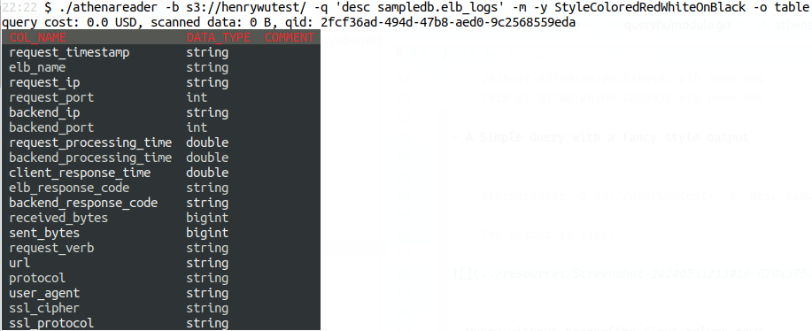

# :shell: athenareader

`athenareader` is a utility tool which query S3 data via Athena from command line. It output query result in CSV format.

## Authentication Method

To avoid exposing access keys(Access Key ID and Secret Access Key) in command line, `athenareader` use [AWS CLI Config For Authentication](https://github.com/uber/athenadriver#use-aws-cli-config-for-authentication) method.

## How to get/build/install `athenareader`

```
go get -u github.com/uber/athenadriver/athenareader
```

## How to use `athenareader`

You can use `athenareader -h` or ` athenareader --help` to the the plain text version of help text below.

You can set options in command line or file `athenareader.config`, which is located at your home directory or the same directory with athenareader binary. When there is overlapping in options, command line option will be preferred.

NAME

	athenareader - Query Athena data and display in command line

SYNOPSIS

	athenareader [-v] [-b OUTPUT_BUCKET] [-d DATABASE_NAME] [-q QUERY_STRING_OR_FILE] [-r] \
	    [-a] [-m] [-y STYLE_NAME] [-o OUTPUT_FORMAT]

DESCRIPTION

```
  -a	Enable admin mode, so database write(create/drop) is allowed at athenadriver level
  -b string
    	Athena resultset output bucket (default "s3://qr-athena-query-result-prod/Henry/")
  -d string
    	The database you want to query (default "default")
  -m	Enable moneywise mode to display the query cost as the first line of the output
  -o string
    	Output format(options: table, markdown, csv, html) (default "csv")
  -q string
    	The SQL query string or a file containing SQL string (default "select 1")
  -r	Display rows only, don't show the first row as columninfo
  -v	Print the current version and exit
  -y string
    	Output rendering style (default "default")
```


EXAMPLES

- A Simple Query with plain style default(csv) output

```
$ athenareader -d sampledb -q "select request_timestamp,elb_name from elb_logs limit 2"
request_timestamp,elb_name
2015-01-03T00:00:00.516940Z,elb_demo_004
2015-01-03T00:00:00.902953Z,elb_demo_004
```
	
- A Simple Query with stylish `table` output

There are many styles to choose:

    StyleDefault, StyleBold, StyleColoredBright, StyleColoredDark,
    StyleColoredBlackOnBlueWhite, StyleColoredBlackOnCyanWhite, StyleColoredBlackOnGreenWhite
    StyleColoredBlackOnMagentaWhite, StyleColoredBlackOnYellowWhite, StyleColoredBlackOnRedWhite
    StyleColoredBlueWhiteOnBlack, StyleColoredCyanWhiteOnBlack, StyleColoredGreenWhiteOnBlack
    StyleColoredMagentaWhiteOnBlack, StyleColoredRedWhiteOnBlack, StyleColoredYellowWhiteOnBlack
    StyleDouble, StyleLight, StyleRounded

You can choose one with `-y STYLE_NAME`. For example, to use `default` style:

    $ athenareader -b s3://henrywutest/ -q 'desc sampledb.elb_logs' -m -o table -y default
    query cost: 0.0 USD, scanned data: 0 B, qid: 96daa3d2-db82-4aa6-8c86-0bf05fd772dc
    +-------------------------+-----------+---------+
    | COL_NAME                | DATA_TYPE | COMMENT |
    +-------------------------+-----------+---------+
    | request_timestamp       | string    |         |
    | elb_name                | string    |         |
    | request_ip              | string    |         |
    | request_port            | int       |         |
    | backend_ip              | string    |         |
    | backend_port            | int       |         |
    | request_processing_time | double    |         |
    | backend_processing_time | double    |         |
    | client_response_time    | double    |         |
    | elb_response_code       | string    |         |
    | backend_response_code   | string    |         |
    | received_bytes          | bigint    |         |
    | sent_bytes              | bigint    |         |
    | request_verb            | string    |         |
    | url                     | string    |         |
    | protocol                | string    |         |
    | user_agent              | string    |         |
    | ssl_cipher              | string    |         |
    | ssl_protocol            | string    |         |
    +-------------------------+-----------+---------+

To use `StyleColoredRedWhiteOnBlack` style:

    $ athenareader -b s3://henrywutest/ -q 'desc sampledb.elb_logs' -m -y StyleColoredRedWhiteOnBlack -o table
        
The output is like:




- A Simple Query with `markdown` output for you to paste the table to where markdown source is needed

```
$ ./athenareader -b s3://henrywutest/ -q 'desc sampledb.elb_logs' -y StyleColoredRedWhiteOnBlack -o markdown
```
    
| col_name | data_type | comment |
| --- | --- | --- |
| request_timestamp | string |  |
| elb_name | string |  |
| request_ip | string |  |
| request_port | int |  |
| backend_ip | string |  |
| backend_port | int |  |
| request_processing_time | double |  |
| backend_processing_time | double |  |
| client_response_time | double |  |
| elb_response_code | string |  |
| backend_response_code | string |  |
| received_bytes | bigint |  |
| sent_bytes | bigint |  |
| request_verb | string |  |
| url | string |  |
| protocol | string |  |
| user_agent | string |  |
| ssl_cipher | string |  |
| ssl_protocol | string |  |


- A Simple Query with `html` output, so you can paste the table to where HTML source is needed

```
$ athenareader -b s3://henrywutest/ -q 'desc sampledb.elb_logs' -o html
```

<table class="go-pretty-table">
  <thead>
  <tr>
    <th>col_name</th>
    <th>data_type</th>
    <th>comment</th>
  </tr>
  </thead>
  <tbody>
  <tr>
    <td>request_timestamp</td>
    <td>string</td>
    <td>&nbsp;</td>
  </tr>
  <tr>
    <td>elb_name</td>
    <td>string</td>
    <td>&nbsp;</td>
  </tr>
  <tr>
    <td>request_ip</td>
    <td>string</td>
    <td>&nbsp;</td>
  </tr>
  <tr>
    <td>request_port</td>
    <td>int</td>
    <td>&nbsp;</td>
  </tr>
  <tr>
    <td>backend_ip</td>
    <td>string</td>
    <td>&nbsp;</td>
  </tr>
  <tr>
    <td>backend_port</td>
    <td>int</td>
    <td>&nbsp;</td>
  </tr>
  <tr>
    <td>request_processing_time</td>
    <td>double</td>
    <td>&nbsp;</td>
  </tr>
  <tr>
    <td>backend_processing_time</td>
    <td>double</td>
    <td>&nbsp;</td>
  </tr>
  <tr>
    <td>client_response_time</td>
    <td>double</td>
    <td>&nbsp;</td>
  </tr>
  <tr>
    <td>elb_response_code</td>
    <td>string</td>
    <td>&nbsp;</td>
  </tr>
  <tr>
    <td>backend_response_code</td>
    <td>string</td>
    <td>&nbsp;</td>
  </tr>
  <tr>
    <td>received_bytes</td>
    <td>bigint</td>
    <td>&nbsp;</td>
  </tr>
  <tr>
    <td>sent_bytes</td>
    <td>bigint</td>
    <td>&nbsp;</td>
  </tr>
  <tr>
    <td>request_verb</td>
    <td>string</td>
    <td>&nbsp;</td>
  </tr>
  <tr>
    <td>url</td>
    <td>string</td>
    <td>&nbsp;</td>
  </tr>
  <tr>
    <td>protocol</td>
    <td>string</td>
    <td>&nbsp;</td>
  </tr>
  <tr>
    <td>user_agent</td>
    <td>string</td>
    <td>&nbsp;</td>
  </tr>
  <tr>
    <td>ssl_cipher</td>
    <td>string</td>
    <td>&nbsp;</td>
  </tr>
  <tr>
    <td>ssl_protocol</td>
    <td>string</td>
    <td>&nbsp;</td>
  </tr>
  </tbody>
</table>


- Query without header(the first column row)

```
$ athenareader -d sampledb -q "select request_timestamp,elb_name from elb_logs limit 2" -r
2015-01-05T20:00:01.206255Z,elb_demo_002
2015-01-05T20:00:01.612598Z,elb_demo_008
```

- Put complex query in a local file

```
$ athenareader -d sampledb -b s3://my-athena-query-result -q tools/query.sql
request_timestamp,elb_name
2015-01-06T00:00:00.516940Z,elb_demo_009
```

- Add `-m` to enable `moneywise mode`. The first line will display query cost under moneywise mode.

```
$ athenareader -b s3://athena-query-result -q 'select count(*) as cnt from sampledb.elb_logs' -m
query cost: 0.00184898369752772851 USD
cnt
1356206
```

- Add `-a` to enable `admin mode`. Database write is enabled at driver level under admin mode.

```
$ athenareader -b s3://athena-query-result -q 'DROP TABLE IF EXISTS depreacted_table' -a

$ athenareader -b s3://henrywutest/ -q 'DROP TABLE IF EXISTS depreacted_table' -o html
writing to Athena database is disallowed in read-only mode
```
	
	
AUTHOR

	Henry Fuheng Wu (wufuheng@gmail.com)

REPORTING BUGS

	https://github.com/uber/athenadriver


