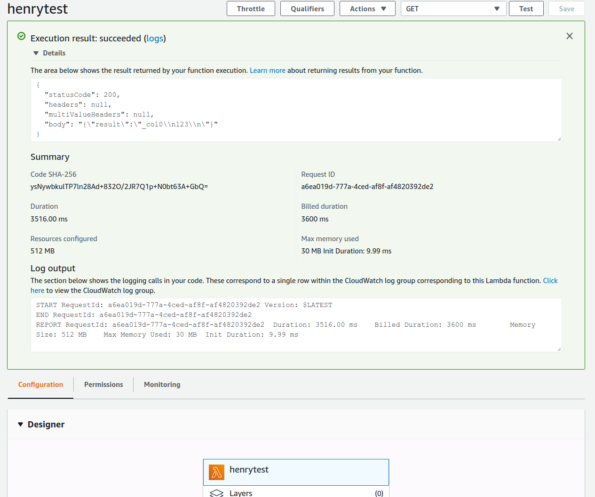

# Query Athena with `athenadriver` in AWS Lambda

## Example

First, install `aws-lambda-go`:

```go
go get github.com/aws/aws-lambda-go/lambda
```

Build and package locally:
```go
go mod init lambda-test
go build main.go && zip function.zip main
```

Then upload `function.zip` to AWS by command line or web console, whichever you like. The handler name is `main` in this case.

Create a test and run a test in AWS Lambda web console, then you can see:

